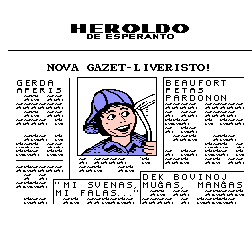
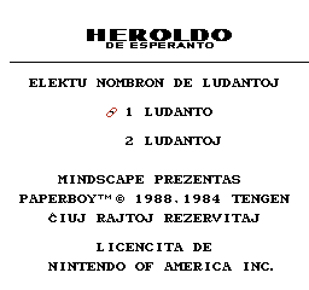
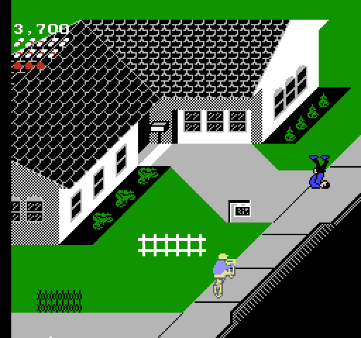
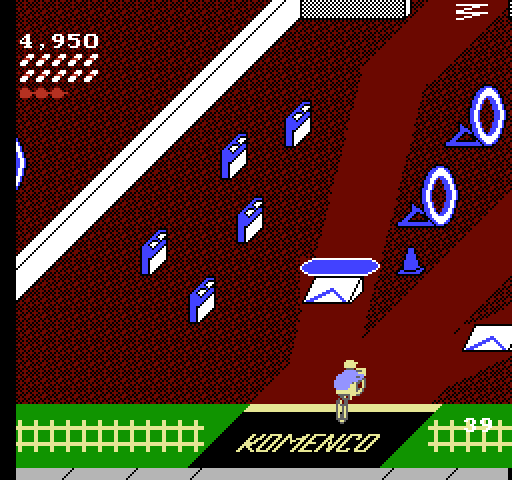
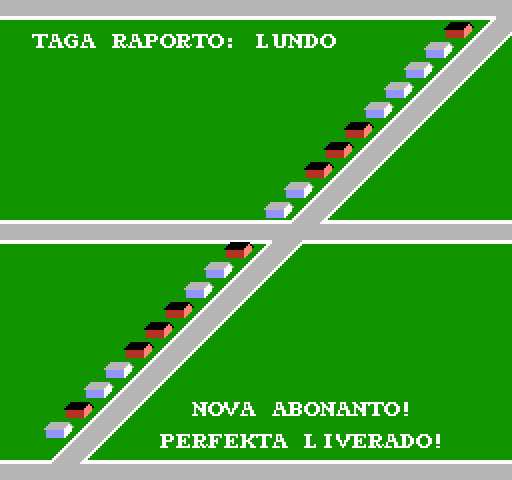
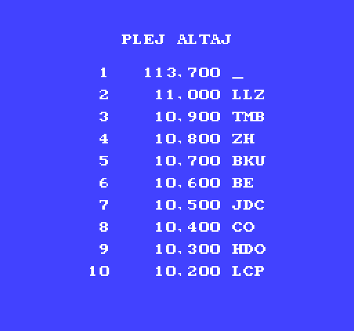

# Paperboy

_Legu
[paperboy-readme.txt](paperboy-readme.txt) por esperanta priskrbo._

This project is a fan translation of
[Paperboy](https://en.wikipedia.org/wiki/Paperboy_(video_game)), a
video game for the Nintendo Entertainment System, to Esperanto. All
copyrights on the original game belong to Tengen and Nintendo.

You *must* own a physical copy of the Paperboy cartridge.
Downloading the ROM of any game which you do not own may be
considered piracy.

  * Paperboy (USA) - CRC32 `EB171D77`

## Screenshots

Here are some pretty screenshots:

